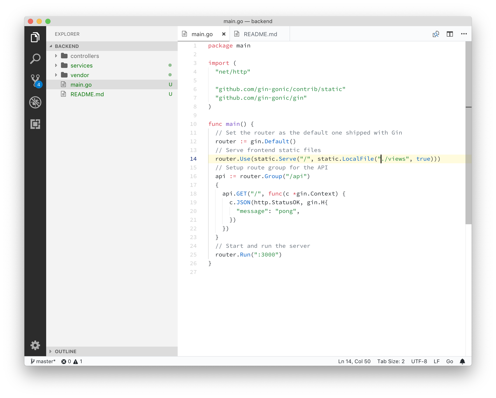

# Frankentheme
Frankentheme is a mix of themes, mainly based on Netbeans and GitHub color schemes

## Screenshots

## License
[MIT License](https://github.com/diegocurbelo/vscode-frankentheme/blob/master/LICENSE)
